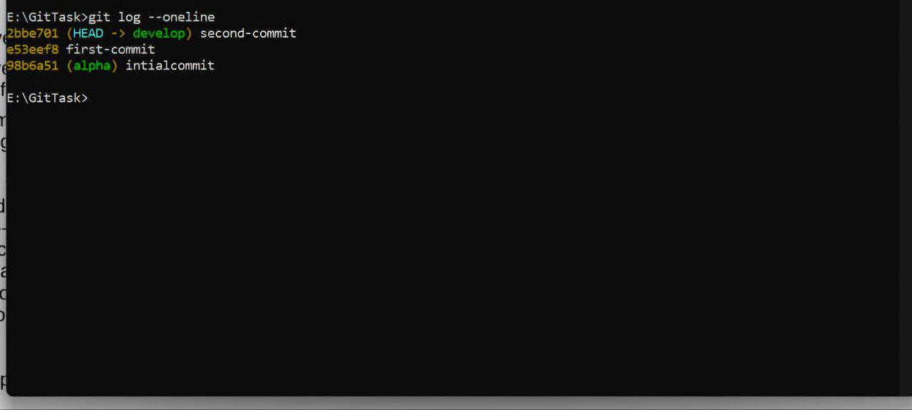
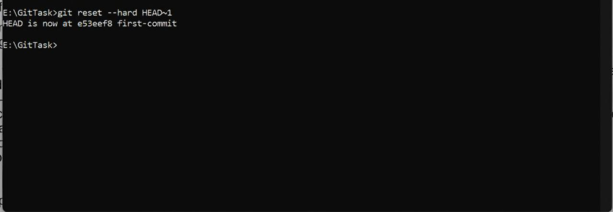
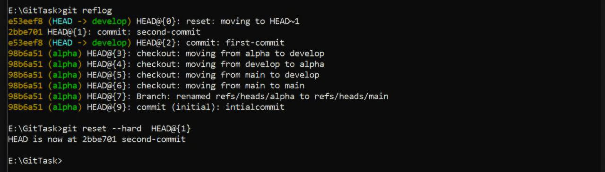
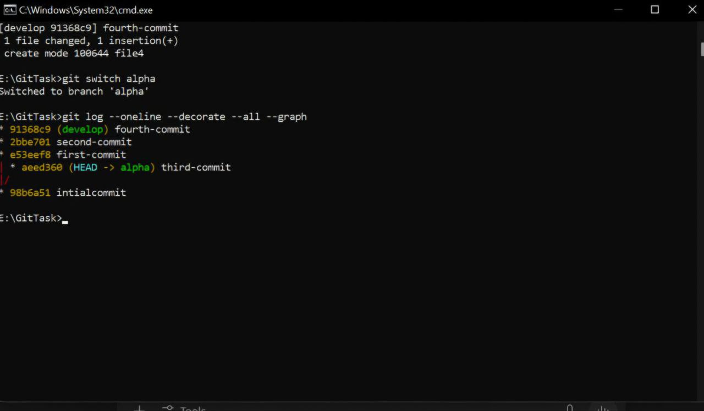
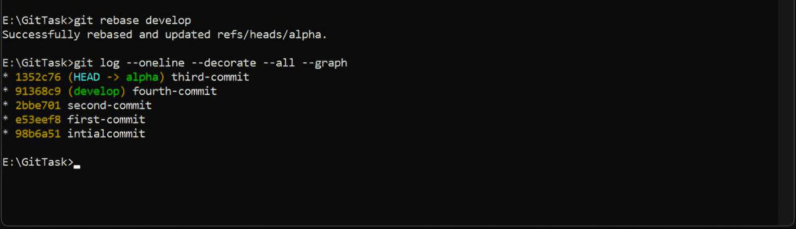

"# GitTask" 
This task demonstrates working with Git branching, committing, history manipulation, and rebasing.

---

## ✅ Branches Created
- `develop`
- `alpha`

---

## 📝 Task Steps

### 1. Created branches `develop` and `alpha`.

### 2. On `develop`:
- Created two files: `file1`, `file2`.
- Committed `file1` with message: `first-commit`.
- Committed `file2` with message: `second-commit`.

### 3. Git log after two commits:

---

### 4. Used `git reset --hard` to go back to first commit:

### 5. Restored second commit using `git reflog`:

---

### 6. On `alpha`:
- Created `file3` and committed as `third-commit`.

### 7. Back to `develop`:
- Created `file4` and committed as `fourth-commit`.

- ---

### 8. Git log graph of all branches:

---

### 9. Rebasing `develop` onto `alpha`:

 
